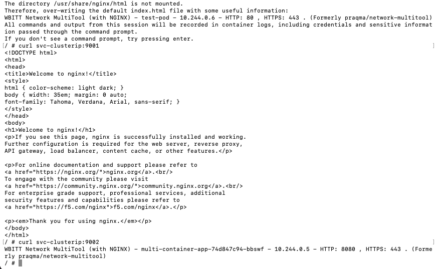
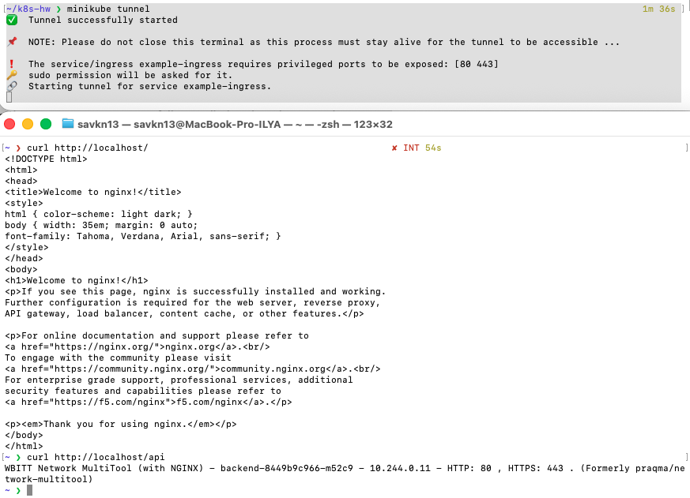

# Домашнее задание к занятию «Сетевое взаимодействие в Kubernetes» Савкин ИН

---

## Задание 1: Настройка Service (ClusterIP и NodePort)

### Манифест Deployment (deployment-multi-container.yaml)

```yaml
apiVersion: apps/v1
kind: Deployment
metadata:
  name: multi-container-app
spec:
  replicas: 3
  selector:
    matchLabels:
      app: multi-container
  template:
    metadata:
      labels:
        app: multi-container
    spec:
      containers:
      - name: nginx
        image: nginx
        ports:
        - containerPort: 80
      - name: multitool
        image: wbitt/network-multitool
        ports:
        - containerPort: 8080
        env:
        - name: HTTP_PORT
          value: "8080"
```

### Манифест Service ClusterIP (service-clusterip.yaml)

```yaml
apiVersion: v1
kind: Service
metadata:
  name: svc-clusterip
spec:
  type: ClusterIP
  selector:
    app: multi-container
  ports:
  - name: nginx
    port: 9001
    targetPort: 80
  - name: multitool
    port: 9002
    targetPort: 8080
```

### Манифест Service NodePort (service-nodeport.yaml)

```yaml
apiVersion: v1
kind: Service
metadata:
  name: svc-nodeport
spec:
  type: NodePort
  selector:
    app: multi-container
  ports:
  - name: nginx
    port: 80
    targetPort: 80
    nodePort: 30080
```

### Проверка доступности изнутри кластера (ClusterIP)

```bash
kubectl run test-pod --image=wbitt/network-multitool --rm -it -- sh
curl svc-clusterip:9001  # nginx
curl svc-clusterip:9002  # multitool
```



### Проверка доступности снаружи (NodePort)

```bash
minikube service svc-nodeport --url
curl http://127.0.0.1:55171
```



---

## Задание 2: Настройка Ingress

### Манифест Deployment frontend (deployment-frontend.yaml)

```yaml
apiVersion: apps/v1
kind: Deployment
metadata:
  name: frontend
spec:
  replicas: 1
  selector:
    matchLabels:
      app: frontend
  template:
    metadata:
      labels:
        app: frontend
    spec:
      containers:
      - name: nginx
        image: nginx
        ports:
        - containerPort: 80
```

### Манифест Deployment backend (deployment-backend.yaml)

```yaml
apiVersion: apps/v1
kind: Deployment
metadata:
  name: backend
spec:
  replicas: 1
  selector:
    matchLabels:
      app: backend
  template:
    metadata:
      labels:
        app: backend
    spec:
      containers:
      - name: multitool
        image: wbitt/network-multitool
        ports:
        - containerPort: 80
        env:
        - name: HTTP_PORT
          value: "80"
```

### Манифест Service frontend (service-frontend.yaml)

```yaml
apiVersion: v1
kind: Service
metadata:
  name: svc-frontend
spec:
  selector:
    app: frontend
  ports:
  - port: 80
    targetPort: 80
```

### Манифест Service backend (service-backend.yaml)

```yaml
apiVersion: v1
kind: Service
metadata:
  name: svc-backend
spec:
  selector:
    app: backend
  ports:
  - port: 80
    targetPort: 80
```

### Манифест Ingress (ingress.yaml)

```yaml
apiVersion: networking.k8s.io/v1
kind: Ingress
metadata:
  name: example-ingress
  annotations:
    nginx.ingress.kubernetes.io/rewrite-target: /
spec:
  rules:
  - http:
      paths:
      - path: /
        pathType: Prefix
        backend:
          service:
            name: svc-frontend
            port:
              number: 80
      - path: /api
        pathType: Prefix
        backend:
          service:
            name: svc-backend
            port:
              number: 80
```

### Включение Ingress-контроллера

```bash
minikube addons enable ingress
```

### Проверка доступности через Ingress

```bash
minikube tunnel   # в отдельном терминале
curl http://localhost/      # frontend → nginx
curl http://localhost/api   # backend → multitool
```


